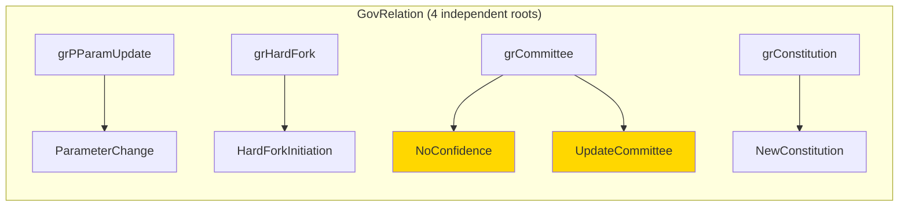
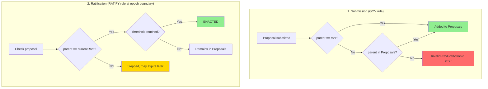
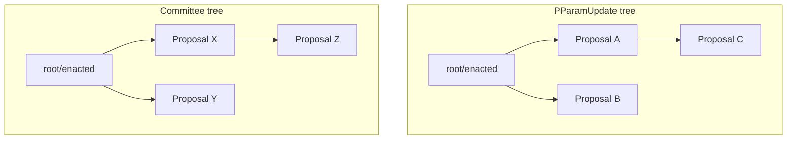
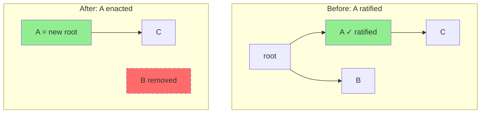
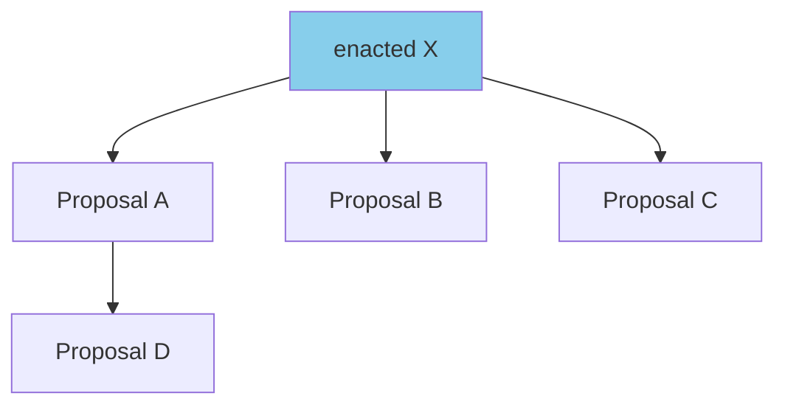
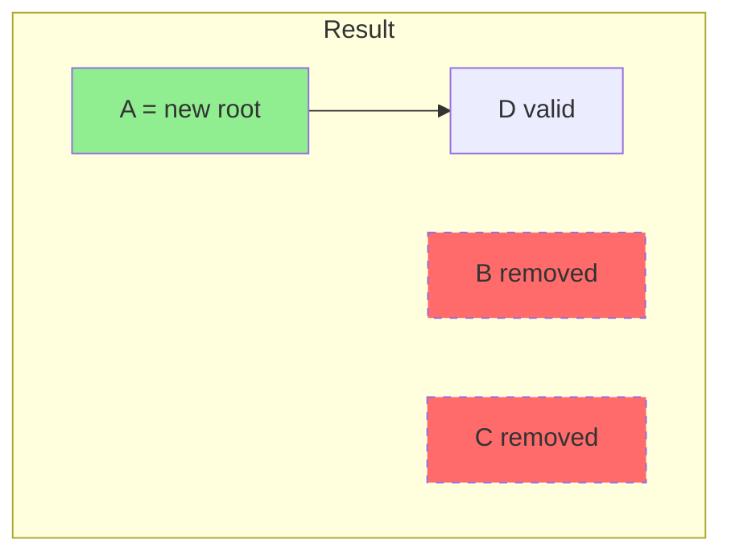
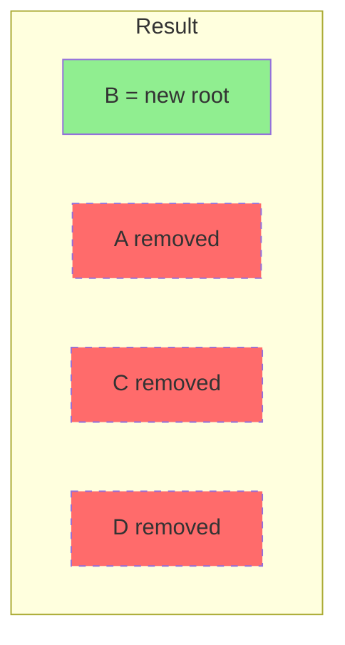
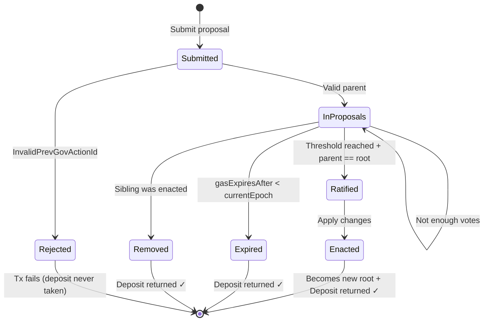

# Previous Governance Action ID

## Overview

In Conway era, governance actions that modify protocol state form **chains by purpose**. Each new proposal must reference the last enacted action of the same type (or nothing if it's the first action of that type).

**Goal**: Prevent conflicts and ensure **sequential application** of changes of the same type.

## Which Proposals Require Previous Gov Action ID?

| GovAction | Requires Previous? | Purpose | Shares Chain With |
|-----------|-------------------|---------|-------------------|
| **ParameterChange** | Yes | PParamUpdatePurpose | - |
| **HardForkInitiation** | Yes | HardForkPurpose | - |
| **NoConfidence** | Yes | CommitteePurpose | UpdateCommittee |
| **UpdateCommittee** | Yes | CommitteePurpose | NoConfidence |
| **NewConstitution** | Yes | ConstitutionPurpose | - |
| **TreasuryWithdrawals** | No | - | - |
| **InfoAction** | No | - | - |

## Four Independent Chains

The ledger maintains 4 independent chains (roots), one for each purpose:



**Important**: `NoConfidence` and `UpdateCommittee` share the **same chain** (CommitteePurpose)!

## Validation Process



### 1. When Proposal is Submitted (GOV rule)

The proposal is added to the Proposals forest. The parent reference is validated:

```
Valid if:
  - parent == currentRoot (Nothing for first action, or last enacted)
  - OR parent exists in Proposals (points to unratified proposal)
```

If neither condition is met → `InvalidPrevGovActionId` error, transaction fails.

### 2. When Proposal is Ratified (RATIFY rule)

At epoch boundary, for ratification to succeed:

```
proposal.parent == ensPrevGovActionIds[purpose]
```

The proposal's parent must match the **currently enacted** action of the same purpose.

If it doesn't match → proposal is NOT ratified (skipped, may expire later).

## Example: ParameterChange Chain

**Initial state**: `prevGovActionIds.PParamUpdate = Nothing`

**Epoch 1**:
- Proposal A submitted: `ParameterChange(parent=Nothing, minFee=100)`
- Validation: parent == root (Nothing) ✓
- Added to Proposals

**Epoch boundary 1→2**:
- A ratified, A enacted
- `prevGovActionIds.PParamUpdate = Just(A)` (root updated)
- A removed from Proposals

**Epoch 2**:
- Proposal B submitted: `ParameterChange(parent=Just(A), minFee=200)`
- Validation: parent == root (Just A) ✓
- Proposal C submitted: `ParameterChange(parent=Nothing, minFee=300)` ❌
- Validation: parent(Nothing) != root(Just A) → **InvalidPrevGovActionId**
- **Transaction FAILS, C is never added to Proposals!**

**Epoch boundary 2→3**:
- B ratified, B enacted
- `prevGovActionIds.PParamUpdate = Just(B)`

## Tree Structure of Proposals

Proposals are stored as a **forest** (4 trees, one per purpose):



When A is enacted:
- A becomes the new root
- A's deposit is returned ✓
- B (sibling) and all its descendants are **removed** (they're no longer valid)
- Deposits for all removed proposals are returned ✓



## Competing Proposals (Siblings)

Multiple proposals can reference the same parent, creating "siblings":



**Scenario 1**: When voting completes and A is ratified:



1. A is enacted
2. B and C are removed (siblings)
3. D remains valid (child of A)

**Scenario 2**: If B was ratified instead:



1. B is enacted
2. A and C are removed
3. D is also removed (child of removed proposal A)

## Why TreasuryWithdrawals and InfoAction Don't Need Previous?

- **TreasuryWithdrawals**: Each withdrawal is independent, they don't conflict with each other. Multiple withdrawals can be enacted in the same epoch.

- **InfoAction**: Purely informational, doesn't change any protocol state. It's just a signal/poll.

These actions don't form chains and can be enacted in parallel.

## Errors Related to Previous Gov Action ID

| Error | When It Occurs |
|-------|----------------|
| `InvalidPrevGovActionId` | Proposal submitted with invalid/non-existent parent |
| `GovActionsDoNotExist` | Voting on a proposal that was removed (sibling was enacted) |

## Proposal Lifecycle



**Note**: Deposit is **always returned** when a proposal leaves the Proposals set, regardless of the reason (enacted, expired, or removed due to sibling enactment).

## Summary

1. **6 action types require chaining**: ParameterChange, HardForkInitiation, NoConfidence, UpdateCommittee, NewConstitution
2. **2 action types are independent**: TreasuryWithdrawals, InfoAction
3. **4 independent chains** exist (Committee purpose is shared by NoConfidence and UpdateCommittee)
4. **Parent must match current root** at ratification time
5. **Siblings are removed** when one of them is enacted
6. **Deposits are ALWAYS returned** when proposal is removed (enacted, expired, or sibling enacted)
