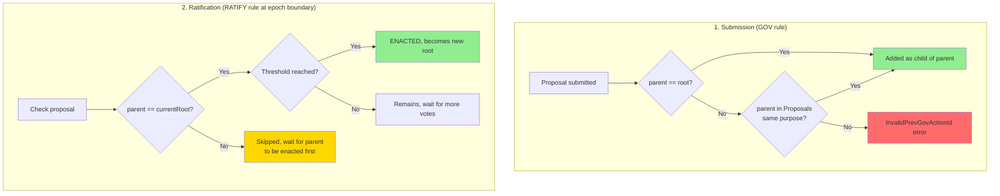
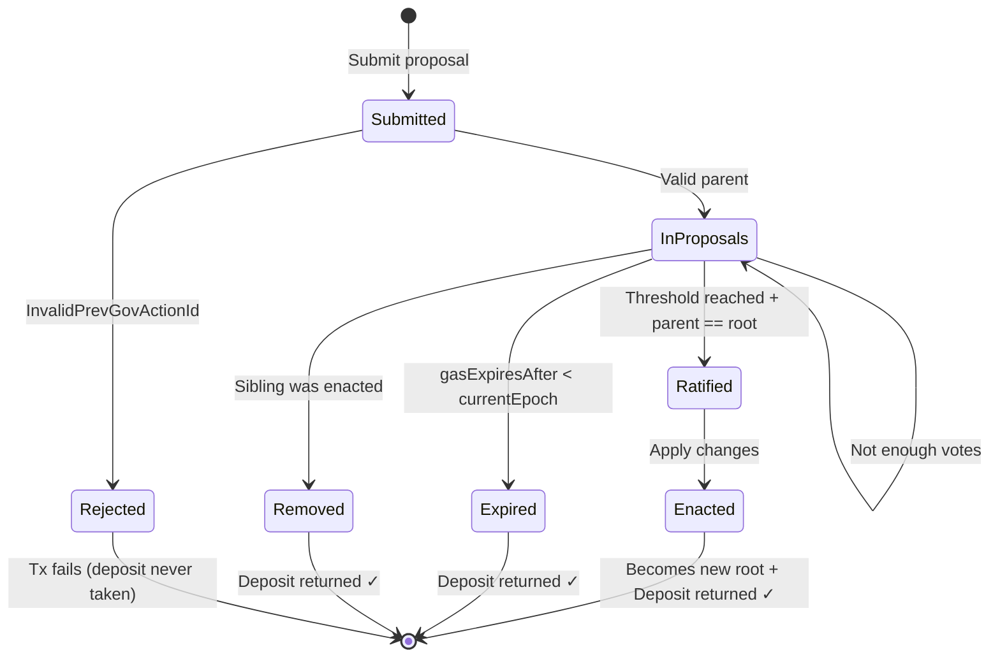

# Previous Governance Action ID

## Overview

In Conway era, governance actions that modify protocol state form **trees by purpose**. Each new proposal must reference either the last enacted action of the same type, or an existing pending proposal of the same type.

**Goal**: Prevent conflicts and ensure **sequential enactment** of changes of the same type.

**Data Structure**: Forest (4 independent trees, one per purpose). Each proposal has exactly 1 parent, but can have multiple children (competing/alternative proposals).

## Which Proposals Require Previous Gov Action ID?

| GovAction | Requires Previous? | Purpose | Shares Tree With |
|-----------|-------------------|---------|------------------|
| **ParameterChange** | Yes | PParamUpdatePurpose | - |
| **HardForkInitiation** | Yes | HardForkPurpose | - |
| **NoConfidence** | Yes | CommitteePurpose | UpdateCommittee |
| **UpdateCommittee** | Yes | CommitteePurpose | NoConfidence |
| **NewConstitution** | Yes | ConstitutionPurpose | - |
| **TreasuryWithdrawals** | No | - | - |
| **InfoAction** | No | - | - |

## Four Independent Trees (Forest)

The ledger maintains 4 independent trees (one root per purpose):

```
GovRelation (4 independent roots):

  grPParamUpdate ──────► ParameterChange

  grHardFork ──────────► HardForkInitiation

  grCommittee ─────────┬► NoConfidence      ← same tree!
                       └► UpdateCommittee   ← same tree!

  grConstitution ──────► NewConstitution
```

**Important**: `NoConfidence` and `UpdateCommittee` share the **same tree** (CommitteePurpose)!

## Validation Process



### 1. When Proposal is Submitted (GOV rule)

The proposal is added to the Proposals forest. The parent reference is validated:

```
Valid if:
  - parent == currentRoot (Nothing for first action, or last enacted)
  - OR parent exists in Proposals tree of the same purpose (points to unratified proposal)
```

This allows building **trees of pending proposals**:

```
root (last enacted)
  ├── Proposal A (parent=root)
  │     └── Proposal B (parent=A)
  │           └── Proposal C (parent=B)
  └── Proposal D (parent=root, sibling of A)
```

If neither condition is met → `InvalidPrevGovActionId` error, transaction fails.

### 2. When Proposal is Ratified (RATIFY rule)

At epoch boundary, for ratification to succeed:

```
proposal.parent == ensPrevGovActionIds[purpose]  (i.e. currentRoot)
```

The proposal's parent must match the **currently enacted** action (root) of the same purpose.

**Important**: Even if a proposal was valid at submission (parent was in Proposals), it can only be ratified when its parent becomes the root (i.e., parent gets enacted first).

Example:
- A (parent=root) and B (parent=A) are both in Proposals
- B cannot be ratified until A is enacted
- When A is enacted, A becomes the new root
- Now B's parent matches root, so B can be ratified

If parent doesn't match current root → proposal is skipped (may be ratified later or expire).

## Example: ParameterChange Tree

**Initial state**: `prevGovActionIds.PParamUpdate = Nothing`

**Epoch 1**:
- Proposal A submitted: `ParameterChange(parent=Nothing, minFee=100)`
- Validation: parent(Nothing) == root(Nothing) ✓
- Added to Proposals

**Epoch boundary 1→2**:
- A ratified, A enacted
- `prevGovActionIds.PParamUpdate = Just(A)` (root updated)
- A removed from Proposals

**Epoch 2**:
- Proposal B submitted: `ParameterChange(parent=Just(A), minFee=200)`
- Validation: parent(A) == root(A) ✓ — Added to Proposals
- Proposal C submitted: `ParameterChange(parent=Just(B), minFee=250)` ✓
- Validation: parent(B) != root(A), BUT B exists in Proposals ✓ — **Added as child of B!**
- Proposal D submitted: `ParameterChange(parent=Nothing, minFee=300)` ❌
- Validation: parent(Nothing) != root(A), Nothing not in Proposals → **InvalidPrevGovActionId**

**Tree state after Epoch 2**:
```
root (A)
  └── B (parent=A)
        └── C (parent=B)
```

**Epoch boundary 2→3**:
- B ratified (parent == root ✓), B enacted
- `prevGovActionIds.PParamUpdate = Just(B)` (root updated)
- B removed, C remains (now C's parent B == root!)

**Epoch boundary 3→4**:
- C ratified (parent == root ✓), C enacted
- `prevGovActionIds.PParamUpdate = Just(C)`

## Tree Structure of Proposals

Proposals are stored as a **forest** (4 trees, one per purpose):

```
PParamUpdate tree:              Committee tree:

     [root]                          [root]
     /    \                          /    \
    A      B                        X      Y
    |                               |
    C                               Z
```

When A is enacted:
- A becomes the new root
- A's deposit is returned ✓
- B (sibling) and all its descendants are **removed** (they're no longer valid)
- Deposits for all removed proposals are returned ✓

```
BEFORE (A ratified):              AFTER (A enacted):

     [root]                          [A] ← new root
     /    \                           |
   [A]✓    B                          C
    |
    C                                B ← removed
```

## Competing Proposals (Siblings)

Multiple proposals can reference the same parent, creating "siblings":

```
        [X] ← current root
       / | \
      A  B  C     ← siblings (all have parent=X)
      |
      D           ← child of A
```

**Scenario 1**: A is ratified:

```
BEFORE:                    AFTER:
        [X]                      [A] ← new root
       / | \                      |
      A  B  C                     D ✓ valid
      |
      D                     B, C ← removed (siblings)
```

1. A is enacted, becomes new root
2. B and C are removed (siblings of A)
3. D remains valid (child of A)

**Scenario 2**: B is ratified instead:

```
BEFORE:                    AFTER:
        [X]                      [B] ← new root
       / | \
      A  B  C               A, C, D ← all removed
      |
      D
```

1. B is enacted, becomes new root
2. A and C are removed (siblings of B)
3. D is also removed (child of removed A)

## Why TreasuryWithdrawals and InfoAction Don't Need Previous?

- **TreasuryWithdrawals**: Each withdrawal is independent, they don't conflict with each other. Multiple withdrawals can be enacted in the same epoch.

- **InfoAction**: Purely informational, doesn't change any protocol state. It's just a signal/poll.

These actions don't form trees and can be enacted in parallel.

## Errors Related to Previous Gov Action ID

| Error | When It Occurs |
|-------|----------------|
| `InvalidPrevGovActionId` | Proposal submitted with invalid/non-existent parent |
| `GovActionsDoNotExist` | Voting on a proposal that was removed (sibling was enacted) |

## Proposal Lifecycle



**Note**: Deposit is **always returned** when a proposal leaves the Proposals set, regardless of the reason (enacted, expired, or removed due to sibling enactment).

## Summary

1. **Structure**: Forest of 4 independent trees (not chains!) — each proposal has 1 parent but can have N children
2. **5 action types require parent reference**: ParameterChange, HardForkInitiation, NoConfidence, UpdateCommittee, NewConstitution
3. **2 action types are independent**: TreasuryWithdrawals, InfoAction
4. **4 independent trees** exist (Committee purpose is shared by NoConfidence and UpdateCommittee)
5. **Parent must match current root** at ratification time (even if submission allowed any ancestor)
6. **Siblings and their subtrees are removed** when one sibling is enacted
7. **Deposits are ALWAYS returned** when proposal is removed (enacted, expired, or sibling enacted)
